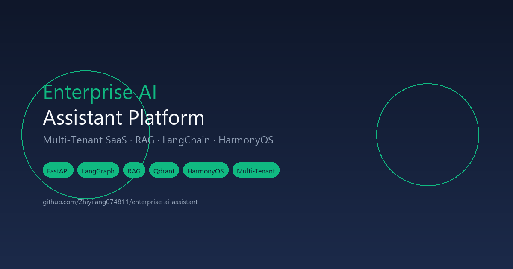
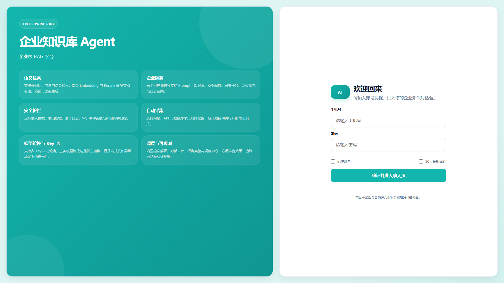
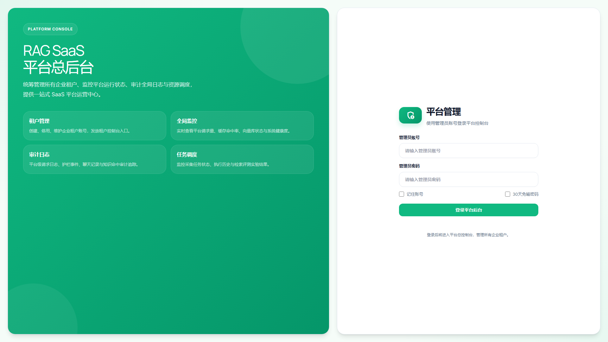
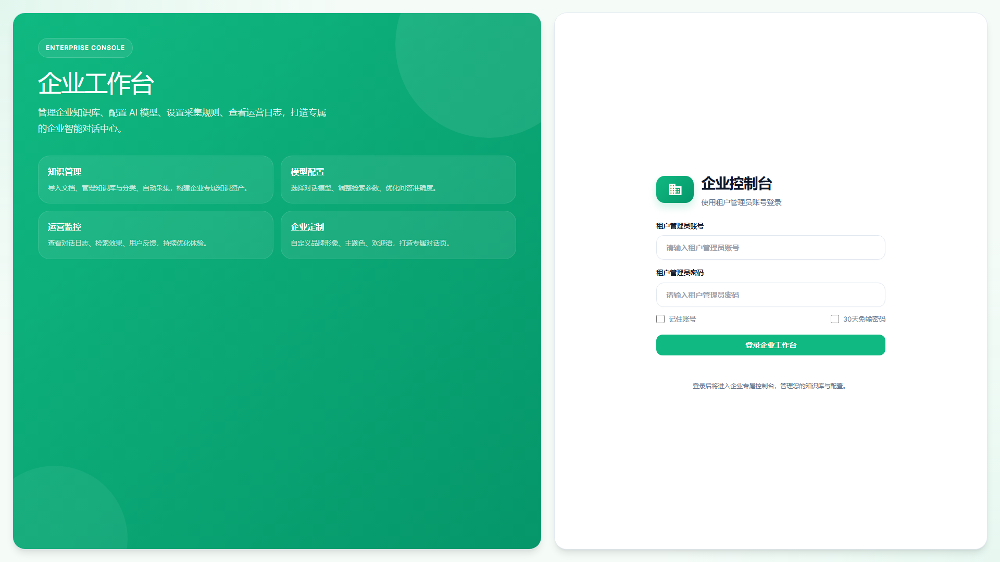
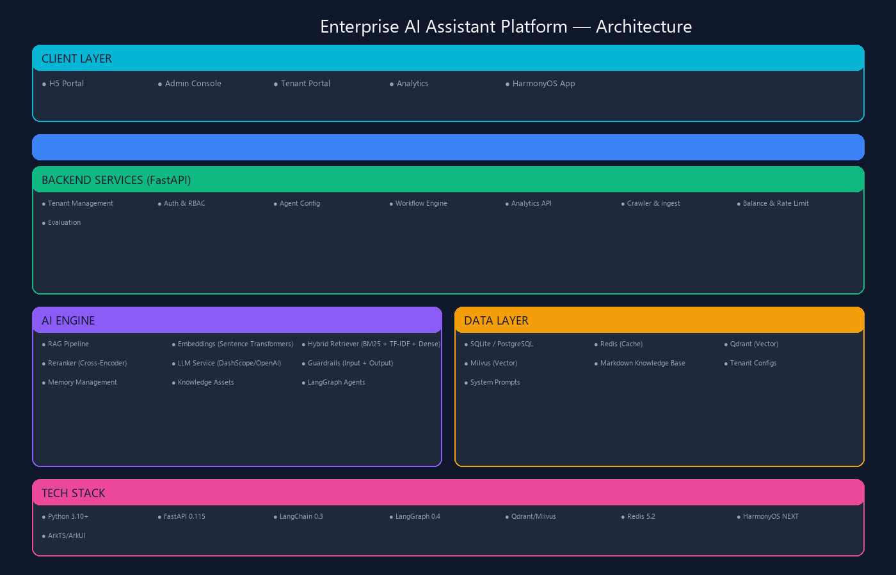

# Enterprise Multi-Tenant AI Assistant Platform

> **面向服务商、SaaS 运营方、集团型企业**的一站式多租户智能问答与流程助手平台
> 基于 RAG 检索增强生成 + LangChain/LangGraph 智能体架构，支撑多客户托管、统一交付和可持续运营的企业级 AI 解决方案

---

## Table of Contents

- [Features](#-features)
- [Screenshots](#-screenshots)
- [Architecture](#-architecture)
- [Tech Stack](#-tech-stack)
- [Quick Start](#-quick-start)
- [API Reference](#-api-reference)
- [Documentation](#-documentation)
- [Use Cases](#-use-cases)
- [Contributing](#-contributing)
- [License](#-license)

---

## Features

### Multi-Tenant SaaS Architecture

| Feature | Description |
|---------|-------------|
| **Tenant Isolation** | 完整的数据和配置隔离，每个租户独立运行，支持无限扩展 |
| **Role-Based Access** | 平台管理员 / 租户管理员 / 终端用户三级角色体系 |
| **Custom Branding** | 按租户自定义 UI 品牌、Logo、主题色，支持白标输出 |
| **Tenant Config** | 每个租户独立配置 LLM 模型、API Key、检索策略、Prompt |
| **Phone Account** | 手机号绑定 + 设备管理 + 余额管理 + 限速控制 |

### AI-Powered Intelligence (RAG)

| Feature | Description |
|---------|-------------|
| **RAG Pipeline** | 检索增强生成，支持多级知识库、分层权重、自动分片 |
| **Multi-LLM** | 支持阿里云通义千问、OpenAI、Claude、国产大模型等可插拔 LLM 后端 |
| **Hybrid Retrieval** | TF-IDF + BM25 + Dense Embedding 三重混合检索 |
| **Reranker** | 智能重排序，提升检索质量 |
| **Vector DB** | 支持 Qdrant / Milvus 双后端向量数据库，自动集合管理 |
| **Agent Framework** | 基于 LangGraph 的智能体编排，可配置业务助手 |
| **Workflow Engine** | 可视化工作流引擎，支持 MCP 工具调用 |
| **Context Memory** | 会话上下文记忆，支持多轮对话 |

### Enterprise Security

| Feature | Description |
|---------|-------------|
| **Input Guardrails** | 输入内容安全过滤 |
| **Output Guardrails** | AI 输出内容安全护栏 |
| **Audit Logging** | 完整的租户活动审计追踪（请求日志、护栏事件） |
| **Rate Limiting** | 并发控制 + 速率限制，防止 API 滥用 |
| **Balance System** | 基于话费的用量管理和余额控制 |
| **Data Encryption** | 支持 HTTPS / SSL 传输加密 |

### Analytics & Operations

| Feature | Description |
|---------|-------------|
| **Platform Dashboard** | 跨租户实时数据分析面板 |
| **Tenant Analytics** | 按租户维度的使用指标、热门问题、活跃用户分布 |
| **Knowledge Base** | 文档摄入、处理、自动爬取与智能检索 |
| **Evaluation** | 检索效果评估工具与跑分系统 |
| **Scheduler** | 定时任务与自动化运营 |

### Cross-Platform

| Feature | Description |
|---------|-------------|
| **H5 Portal** | 用户登录与智能问答入口 |
| **Admin Console** | 全功能平台管理后台（Admin V2） |
| **Tenant Portal** | 租户自助管理界面（Tenant V2） |
| **Analytics Dashboard** | 实时数据分析面板 |
| **HarmonyOS App** | 鸿蒙原生移动应用（ArkTS + ArkUI） |
| **Voice Interaction** | 集成华为语音识别（ASR）与语音合成（TTS） |

---

## Screenshots

> 以下为**真实运行截图**，基于 TailwindCSS 现代化 UI 设计，支持暗色模式。

### Hero Banner

### Login Page

现代化登录界面，支持手机号绑定和设备管理。

### Index / Chat Page

主对话页面，流式响应体验。

### Admin Console

全功能平台管理后台，支持租户管理、知识库管理、数据分析、爬虫配置等。

### Tenant Portal

租户自助管理界面，支持智能体配置、知识库管理、工作流编排。

### Analytics Dashboard

实时数据分析面板，展示使用指标和性能趋势。

### Platform Analytics

跨租户数据分析，平台级运营监控。

---

## Architecture

`
┌──────────────────────────────────────────────────────────────────┐
│                        Client Layer                               │
│  ┌────────────┐  ┌────────────┐  ┌────────────┐  ┌───────────┐  │
│  │  H5 Portal │  │ Admin V2   │  │ Tenant V2  │  │ HarmonyOS │  │
│  │ (Login)    │  │ (Platform) │  │ (Self-svc) │  │   App     │  │
│  └────────────┘  └────────────┘  └────────────┘  └───────────┘  │
└──────────────────────────────────────────────────────────────────┘
                              │
                      ┌───────▼───────┐
                      │  Nginx / GW  │
                      └───────┬───────┘
                              │
┌─────────────────────────────┼──────────────────────────────────┐
│         Backend Services (Double-Backend Mode)                 │
│                                                                  │
│  ┌──────────────────────────┐  ┌────────────────────────────┐  │
│  │   Business API Server    │  │         AI Engine          │  │
│  │                          │  │                            │  │
│  │  • Tenant Mgmt           │  │  • RAG Pipeline            │  │
│  │  • Auth / Phone Login    │  │    ├─ Embeddings           │  │
│  │  • Agent Mgmt            │  │    ├─ Retriever (Hybrid)   │  │
│  │  • Workflow Engine       │  │    ├─ Reranker             │  │
│  │  • Scheduler             │  │    ├─ LLM Service          │  │
│  │  • Analytics API         │  │    ├─ Guardrails (2-tier)  │  │
│  │  • Crawler / Ingest      │  │    ├─ Memory / Context     │  │
│  │  • Balance / Rate Limit  │  │    ├─ Knowledge Assets     │  │
│  │  • Evaluation            │  │    └─ LangGraph Agents     │  │
│  │  • Device Binding        │  │                            │  │
│  └──────────┬───────────────┘  └────────────┬───────────────┘  │
│             │                                │                  │
│  ┌──────────▼────────────────────────────────▼───────────────┐  │
│  │                     Data Layer                            │  │
│  │  ┌──────────┐  ┌──────────┐  ┌──────────┐  ┌──────────┐ │  │
│  │  │SQLite / │  │  Redis   │  │ Qdrant / │  │ Markdown │ │  │
│  │  │PostgreSQL│  │  (Cache) │  │  Milvus  │  │ KB Files │ │  │
│  │  └──────────┘  └──────────┘  └──────────┘  └──────────┘ │  │
│  └──────────────────────────────────────────────────────────┘  │
└──────────────────────────────────────────────────────────────────┘
`

---

## Tech Stack

### Backend

| Component | Technology | Version | Purpose |
|-----------|-----------|---------|---------|
| Language | Python | 3.10+ | Core implementation |
| Framework | FastAPI | 0.115 | RESTful API server |
| Server | Uvicorn | 0.30 | ASGI server |
| AI Orchestration | LangChain + LangGraph | 0.3.x / 0.4 | LLM workflow & agent orchestration |
| Embeddings | Sentence Transformers / OpenAI | - | Text vectorization |
| RAG Engine | Custom Pipeline | - | Retrieval-Augmented Generation |
| Retriever | BM25 + TF-IDF + Dense | - | Hybrid retrieval stack |
| Reranker | Custom Service | - | Result re-ranking |
| Caching | Redis | 5.2 | Session & semantic cache |
| Security | JWT + RBAC | - | Auth & authorization |

### Vector Databases (Pluggable)

| Database | Purpose | Status |
|----------|---------|--------|
| Qdrant | Primary vector store | Supported |
| Milvus | Scalable vector store | Supported |

### Frontend

| Component | Tech | Purpose |
|-----------|------|---------|
| Login Portal | HTML5 / JS / TailwindCSS | User login & tenant selection |
| Admin Console | HTML5 / JS / TailwindCSS | Platform admin dashboard |
| Tenant Portal | HTML5 / JS / TailwindCSS | Tenant self-service management |
| Analytics | HTML5 / JS / TailwindCSS | Real-time metrics dashboards |

### HarmonyOS Mobile App

| Component | Tech | Purpose |
|-----------|------|---------|
| Language | ArkTS | Native development |
| UI Framework | ArkUI | Declarative UI |
| Backend | HTTP (NetworkKit) | REST API calls to FastAPI |
| Voice | Huawei ASR/TTS | Speech recognition & synthesis |
| Streaming | SSE | Stream chat responses |

---

## Quick Start

### Prerequisites

- Python 3.10 or higher
- (Optional) Redis 7+ for caching
- (Optional) Qdrant or Milvus for vector storage
- LLM API Key (e.g., DashScope / OpenAI)

### Installation

`ash
# Navigate to the Python project directory
cd docs/py

# Create virtual environment
python -m venv venv

# Activate it
# Windows:
venv\Scripts\activate
# Linux/Mac:
source venv/bin/activate

# Install dependencies
pip install -r requirements.txt

# Configure API keys
# Option 1: Edit config/api_keys.txt
# Option 2: Set environment variable
#   export DASHSCOPE_API_KEYS="sk-your-key-here"

# Start the application
bash start.sh
# Or on Windows:
python -m uvicorn backend.main:app --host 0.0.0.0 --port 6090
`

### Access the Application

| Service | URL |
|---------|-----|
| H5 Portal | http://localhost:6090 |
| Admin Console | http://localhost:6090/admin |
| Tenant Portal | http://localhost:6090/tenant |

### Default Credentials

| Role | Username | Password |
|------|----------|----------|
| Platform Admin | \platform_admin\ | \Platform@2026\ |
| Tenant Admin | \	enant_admin\ | \Tenant@2026\ |

> **Security**: Change default passwords after first login.

---

## API Reference

The platform exposes a comprehensive REST API with **158+ endpoints**:

### Authentication & Accounts

| Method | Endpoint | Description |
|--------|----------|-------------|
| POST | \/api/auth\ | Phone number login |
| POST | \/api/password/change\ | Change password |
| GET | \/api/balance\ | Query user balance |

### Chat & AI

| Method | Endpoint | Description |
|--------|----------|-------------|
| GET | \/api/public/app-config\ | Get public app configuration |
| GET | \/api/public/tenant-app-config\ | Get tenant-specific config |
| POST | \/api/public/chat\ | Stream chat (SSE response) |
| POST | \/consoleapi/v1/chat\ | Console chat API |
| GET | \/consoleapi/v1/conversations\ | List conversations |
| GET | \/consoleapi/v1/conversations/{id}/messages\ | Get conversation messages |

### Admin APIs

| Method | Endpoint | Description |
|--------|----------|-------------|
| POST | \/api/admin/login\ | Admin login |
| GET | \/api/admin/accounts\ | List accounts |
| GET | \/api/admin/chat-logs\ | Chat log audit |
| GET | \/api/admin/observability/summary\ | Observability summary |
| GET | \/api/admin/evaluations\ | Evaluation runs |
| POST | \/api/admin/evaluations/run\ | Run evaluation |
| GET | \/api/admin/observability/requests\ | Request logs |
| GET | \/api/admin/guardrail-events\ | Guardrail events |
| GET | \/api/admin/tenants\ | List tenants |
| POST | \/api/admin/tenants\ | Create tenant |
| PUT | \/api/admin/tenants\ | Update tenant |
| POST | \/api/admin/knowledge/upload\ | Upload knowledge file |
| GET | \/api/admin/knowledge/stats\ | Knowledge stats |
| GET | \/api/admin/app-config\ | App config |
| PUT | \/api/admin/app-config\ | Update app config |
| GET | \/api/admin/model-config\ | Model config |
| PUT | \/api/admin/model-config\ | Update model config |
| GET | \/api/admin/crawler-config\ | Crawler config |
| POST | \/api/admin/crawler-config/run\ | Run crawler |
| GET | \/api/admin/crawler-runs\ | Crawler run history |
| GET | \/api/admin/crawler-scheduler\ | Crawler scheduler |
| POST | \/api/admin/knowledge/rebuild\ | Rebuild knowledge index |
| GET | \/api/admin/release-profiles\ | Release profiles |
| POST | \/api/admin/release/export\ | Export release bundle |

### Tenant APIs

| Method | Endpoint | Description |
|--------|----------|-------------|
| POST | \/api/tenant/auth\ | Tenant authentication |
| POST | \/api/tenant/chat\ | Tenant chat |
| GET | \/api/tenant/app-config\ | Tenant app config |
| PUT | \/api/tenant/app-config\ | Update tenant config |
| GET | \/api/tenant/system-prompt\ | System prompt |
| PUT | \/api/tenant/system-prompt\ | Update system prompt |
| GET | \/api/tenant/knowledge/overview\ | Knowledge overview |
| POST | \/api/tenant/knowledge/upload\ | Upload knowledge file |
| POST | \/api/tenant/knowledge/upload-web\ | Web crawl ingest |
| GET | \/api/tenant/knowledge/files\ | List knowledge files |
| DELETE | \/api/tenant/knowledge/file\ | Delete knowledge file |
| GET | \/api/tenant/agents\ | List agents |
| POST | \/api/tenant/agents\ | Create agent |
| DELETE | \/api/tenant/agents/{id}\ | Delete agent |
| GET | \/api/tenant/users\ | List users |
| POST | \/api/tenant/users\ | Create user |
| GET | \/api/tenant/workflows\ | List workflows |
| POST | \/api/tenant/workflows/publish\ | Publish workflow |
| POST | \/api/tenant/workflows/run\ | Run workflow |
| GET | \/api/tenant/analytics/summary\ | Analytics summary |
| GET | \/api/tenant/analytics/daily-trends\ | Daily trends |
| GET | \/api/tenant/analytics/top-questions\ | Top questions |
| GET | \/api/tenant/analytics/active-users\ | Active users |
| GET | \/api/tenant/analytics/hourly-distribution\ | Hourly distribution |
| GET | \/api/tenant/chat-logs\ | Chat logs |
| GET | \/api/tenant/request-logs\ | Request logs |
| GET | \/api/tenant/guardrail-events\ | Guardrail events |

### HarmonyOS App APIs

| Method | Endpoint | Description |
|--------|----------|-------------|
| POST | \/api/chat\ | Chat with streaming |
| POST | \/api/chat/sessions/list\ | List sessions |
| POST | \/api/chat/sessions/create\ | Create session |
| POST | \/api/chat/sessions/messages\ | Get session messages |
| POST | \/api/chat/agents\ | Manage agents |
| GET | \/api/queue/status\ | Queue status |

> Full API documentation: [二开与接口说明](docs/04_二开与接口说明.md)

---

## Documentation

Complete documentation is available in the \docs/\ directory:

| Document | Description |
|----------|-------------|
| [版本与交付说明](docs/00_版本与交付说明.md) | Release notes and delivery checklist |
| [功能介绍](docs/01_功能介绍.md) | Complete feature catalog |
| [部署与启动](docs/02_部署与启动.md) | Installation and deployment guide |
| [使用教程](docs/03_使用教程.md) | Step-by-step usage guide |
| [二开与接口说明](docs/04_二开与接口说明.md) | API reference and extension guide |
| [运维排障](docs/05_运维排障.md) | Monitoring and troubleshooting |
| [检索与向量库说明](docs/06_检索与向量库说明.md) | RAG and vector database details |

### HarmonyOS App

See [harmony_app/README.md](harmony_app/README.md) for mobile app development and deployment guide.

See [harmony_app/参赛指南.md](harmony_app/参赛指南.md) for competition preparation guide.

---

## Use Cases

- 🏢 **Enterprise Internal Knowledge Base** — 集中企业知识，AI 驱动的智能搜索与问答
- 📞 **Customer Service Automation** — 智能客服问答与工单处理
- 📋 **Business Process Assistant** — 复杂业务流程的 AI 引导与自动化
- 🎓 **Training & Onboarding** — AI 驱动的学习助手与培训
- 🔍 **Regulatory Compliance** — 智能文档审查与合规检查
- 💼 **SaaS Product Platform** — 面向客户的白标 AI 助手平台
- 📱 **Multi-Device Experience** — 支持 Web + HarmonyOS 跨设备协同

---

## Contributing

We welcome contributions! Please see our [Contributing Guide](CONTRIBUTING.md) for details.

1. Fork the repository
2. Create your feature branch (\git checkout -b feature/amazing-feature\)
3. Commit your changes (\git commit -m 'Add amazing feature'\)
4. Push to the branch (\git push origin feature/amazing-feature\)
5. Open a Pull Request

---

## License

This project is licensed under the MIT License — see the [LICENSE](LICENSE) file for details.

---

**Built for enterprises. Powered by AI. Open Source.**

Made with ❤️ by [Zhiyilang074811](https://github.com/Zhiyilang074811)

